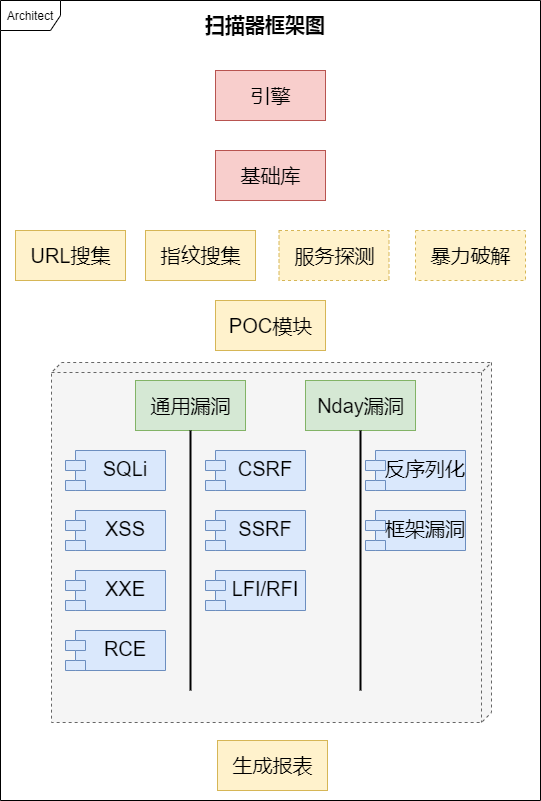

## h0rse是什么

h0rse是一个更现代化的Web漏洞扫描器，开发它的目的在于获取比同类产品更快的性能。一个字，快！

目前同类产品的瓶颈表现于:

- 检测方法老旧，似乎自动化测试到了一个瓶颈，再想精准貌似只能通过人工；
- py语言版常规套路的多进程、多线程的模式受制于GIL，效率并不是很高；
- Web2.0时代，越来越多的数据通过Ajax请求，使得单个URL请求网页难以拿到有用数据。

针对问题一，作者目前的技术功底还不够；针对问题二，引入基于协程的asyncio应该能大幅度提高效率；针对问题三，业界常规套路是使用无头浏览器处理。

## 项目框架

| 模块名称 | 子类明细 | 功能描述 |
| --- | --- | --- |
| 引擎 | | 任务划分、调度、结果汇总 |
| 基础库 | HTTP元素封装、日志库、页面相似度分析等 | 所有功能模块会用的的底层库，如请求收发、日志记录等 |
| 功能模块 | 信息搜集类模块、代码验证类模块 | 一些用于实现具体功能的代码块 |
| URL搜集模块 | | 爬虫获取HTML中所有链接，会涉及到js中链接和事件的触发 | 
| 指纹搜集模块 | | 自己建立知识库太麻烦，最好使用厂家的API |
| POC模块| 通用漏洞模块、Nday漏洞模块| 通用漏洞模块的payload可以从github来，Nday漏洞的检测和pocsuite联动 |
| 报表模块 | | 汇总扫描、分析结果，并归纳形成文档HTML等 | 

## 进度安排

2020年，竟然又到了5月。也不知道这个月一番挣扎能否完工。

1. 5.12-5.17，框架代码的设计、编写、测试
2. 5.18-5.24，单个功能的完善、POC模块、SQLi模块
3. 5.25-5.31，报表完成、代码重构、优化
4. 6月份，技术瓶颈的解决方案实现（页面相似、URL语义分析）
5. 6月份，其他功能模块的编写、测试 

## 功能构想

有个idea——**既然写一个大而全的自动化扫描器有诸多弊端（要处理千奇百怪的容错，出现异常难以恢复现场等），
不如高度解耦，为用户保留单独使用某功能的权力**： 

>1 --> 高级爬虫（提取有用信息：公开信息、Url、接口等）可采取静态爬虫或基于无头浏览器的动态爬虫
>2 --> 单个功能的使用（需考虑接口的预留）
>3 --> 全自动化Batch 

**注意HTTP信息的格式以此实现和burpsuite的兼容性。**

## 特性构想

V1.0开发完后，它应该具备以下特性：

1. 基于aiohttp实现，可以设置爬虫的协程数，爬取+解析大型网站在数秒之内；
2. 广度+深度优先策略：首页用广度获取最多的子域名，然后依次分析每个子域名下的目录；
3. 跟进前、后端URL跳转，使爬虫继续下去；(到底该跟不跟)
4. 识别404错误，避免爬虫宕机；
5. URL去重、去似、去含，从而提取出值得注入分析的端点；
6. 检测表单并自动填写，检测Ajax事件（暂未想好怎么做）；
7. 断连重试机制（包括有一定道理的策略）；
8. Payload的生成、注入、输出分析功能（Fuzzer）；
9. 简单的报告输出功能（控制台输出）。

## 一些感悟

最早写这个项目，是因为看过一本叫《白帽子讲Web扫描》的书，想炮制一个。所以一开始的设计意图是很模
糊的，只是觉得该有某个功能，就往里面项目里加。最近的挖洞经历使我意识到——**大而
全的扫描器在单个功能的准确性与性能上往往不如小而专的工具**。开发它的价值
在于省力，通过自动化测试来缩短人工排查的时间，所以它其实是人工渗透经验的总结，
误报、漏报都太正常，只不过我们要想办法降低这两项指标。

另一点感悟便是写完一个工具和写好一个工具是两回事，后者要考虑很多。一直在纠结要不要直接上pyppeteer对付XHR，坦白的将要写好这个
软件早晚要做这一点。但目前已经写出了1.0版本的雏形，现在掉头去搞WEB2.0有点可惜，
而且有很多功能点是写2.0不可避免地。比如去重（REST结构的怎么判断）、页面比较
算法、注入->分析的通用模式，爬爬取策略等。这些都值得在1.0时候就去试水。因为只有
通过第一代反复测试，才能理解下一代的优化点在哪里。

## 特别鸣谢

1. [https://github.com/imiyoo2010/teye_scanner_for_book](https://github.com/imiyoo2010/teye_scanner_for_book)

## 参考阅读:

1. [https://www.anquanke.com/post/id/178339]()
2. [http://blog.fatezero.org/2018/03/05/web-scanner-crawler-01/]()
3. [http://blog.fatezero.org/2018/04/09/web-scanner-crawler-02/]()
4. [http://blog.fatezero.org/2018/04/15/web-scanner-crawler-03/]()
