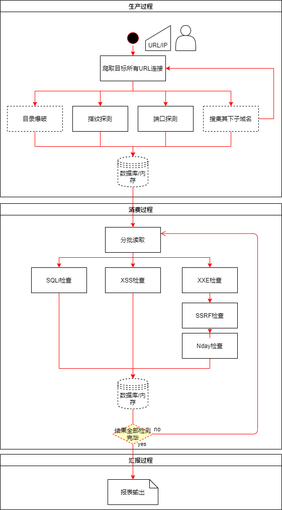

## 初步设计图

## 思路

生产过程：

- 用户输入url
- 爬虫扫描目标页面{寻找其子域（待写或集成其他开源）、探测其端口（集成nmap）、指纹探测（使用指纹网站api）、猜解目录（待写或集成其他开源）}
- 将结果存入消息队列？？（下一代引入）内存or数据库，并发送信号
- 期间产生的所有日志（正常、错误）统统写入logA。

消费过程：

- 收到信号，从内存or数据库分批读取结果（考虑对内存的使用率）
- 并行or串行多个模块的检测（模块较多时应当做个整合，将耗时少的模块串行在一个线程中，这样最终的几个线程运行时间应该差不多（貌似又没必要！））
- 将结果存入分析结果表中，如果所有扫描结果表中数据全部读完，则产生信号。
- 每个线程在扫描的同时将结果按统一格式存入内存or数据库中。期间产生的所有日志（正常、错误）统统写入logB。

产生报表：

- 报表模块从结果集中取出结果，按照预定的HTML模板生成结果。

## 扩展性

- 分析类模块完全可以采用抽象基类的方式实现，因为发送请求、读取响应、按某种规则判断漏洞都存在共性
